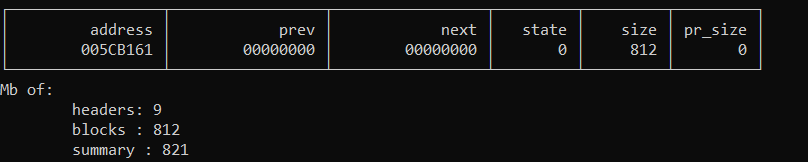
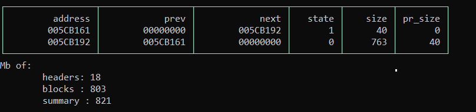
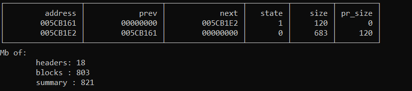

# memory-allocator-v7

memory-allocator-v7 - **test** of the **base mechanic** and **algorithms** of **memory allocator** (not actually implementing the allocator)..
Thanks to the technology of pointers C and C ++ are one of the most convenient tools for creating a memory allocator. In most modern languages, the work with memory is left to the machine, but in some cases it is necessary to shift such a difficult task from the compiler to the hands of the developer.

## Short description

This project test based on the pointer arithmetic to move between the blocks. Block consist of *header* and data-block. The *header* consist of:

* current block size : **4 bytes**
* previous block size : **4 bytes**
* data is occupied : **1 bytes**

Size of *header* of a block is **9 bytes** and because project use *alignment* by **4 bytes**, a minimal size of memory that we need: **9B** of header to make a memory block **+ 9B** of free space to allocate a new block **+ 2B** to align to 4 byte boundary = **20B**.

## Algorithm description

```c++
void* mem_alloc(size_t size)
```

Memory allocation search free memory by **TLSF (Two-Level Segregated Fit)**. **If exist suitable** block (mostly good-fit block) **then allocate** memory, **another way** it could **separate** part of **free memory** to create a suitable block **or return  *nullptr* ** when memory is not enough.

**TLSF algorithm** in this project:

1. Search enough big free block.
2. If exist - use smaller, but suitable block.

```c++
void* mem_realloc(void* addr, size_t size)
```

This function call first of all decides, if it has to make the block smaller or bigger.

**If the block is going to become smaller**, the current memory block will be splitted into two: the 'new data' block and the 'freed memory' block. Then the `mem_free` function is called ('freed memory' block pointer is passed there as an argument).

**If the block is going to become bigger**, first of all, it is analyzed, if the memory block can "overflow" to the adjacent block of free memory (if they exist). If it's not possible, the `mem_alloc` function is called to find the free memory block with enough free memory and the data is copied to the new block. The old block data is deleted, the `mem_free` is called with the old block data pointer passed as the argument.

```c++
void mem_free(void* addr)
```

The function deletes the data of the block, flags it as the 'free  memory' block and tries to merge with adjacent 'free memory' blocks, if  present.

```c++
void mem_dumo()
```

Show dump of virtual memory.


## Usage

'allocate' total memory that you want to use by:

1. Write to SIZE size of your free memory in bytes (default 812).

   > Watch that it was smaller then MEM_SIZE (default 1024).

2. Create block

   ```c++
   START = block(SIZE); 
   ```

   

3. Allocate memory

   ```c++
   void* mypointer = mem_alloc(x);//where x is size that you want to allocate
   ```

   

4. Reallocate memory

   ```c++
   mem_realloc(mypointer, 10);
   ```

   

5. Free memory

   ```
   mem_free(mypointer);
   ```

   

   > Check memory after any operations
   >
   > ```c++
   > mem_dump();
   > ```

## Support

Project won`t be supported, but could be updated.

## Roadmap

No way.

## Contributing

Pull requests are welcome.

## Project status

The project was completed.
